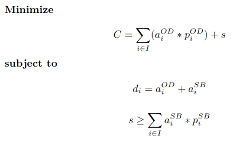

# Allocator

Given a demand for cloud resources (number of instances) and the available value of savings plans over time, allocate the instances in the savings plans and on-demand markets.

We consider the demand with different instance types, which can have different prices and different discounts between the savings plans and on-demand markets. In all implementations, the decision is made for each hour individually.

## Greed Heuristic

Allocates the instance types by their prices. The instance types that have higher prices are allocated to savings plans first. The rest is allocated to the on-demand market.

## Optimal Solution

Uses a linear programming model to solve the problem:

